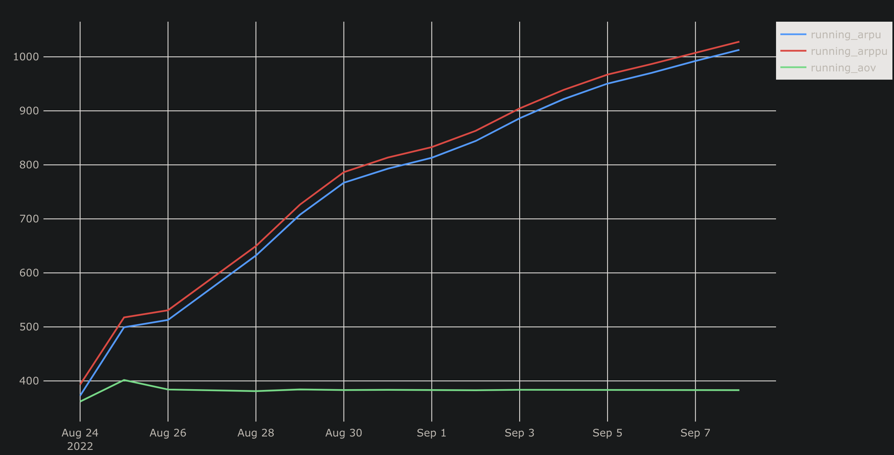

### Вывод по анализу метрик

#### 1. Динамика рассчитанных метрик

- **Running ARPU** (Average Revenue Per User) и **Running ARPPU** (Average Revenue Per Paying User) демонстрируют **устойчивый рост** на протяжении всего периода (с 24 августа по 7 сентября 2022 г.):  
  - Начинаются с уровня ~400–450  
  - Постепенно увеличиваются до ~1000 к концу наблюдаемого периода  

- **Running AOV** (Average Order Value) ведёт себя иначе:  
  - После небольшого пика в начале (~400) быстро стабилизируется  
  - В дальнейшем колеблется в узком диапазоне ~380–400, демонстрируя **практически постоянное значение**

> **Итог:** ARPU и ARPPU растут, AOV остаётся стабильным.

---

#### 2. Рост числа заказов на одного пользователя?

**Да, можно сделать такое предположение.**

**Обоснование:**

- ARPPU растёт, в то время как AOV остаётся неизменным.  
- Поскольку:
  ARPPU = AOV
  то при **фиксированном AOV** рост ARPPU возможен **только за счёт увеличения числа заказов на одного платящего пользователя**.

- Дополнительно, рост ARPU указывает на то, что всё большая доля пользователей либо становится платящей, либо платящие пользователи становятся активнее — что также согласуется с гипотезой о росте частоты заказов.

> **Вывод:** Со временем пользователи совершают **больше заказов**, при этом **средний чек на заказ не меняется**. Это говорит о росте вовлечённости и/или лояльности платящих пользователей.
