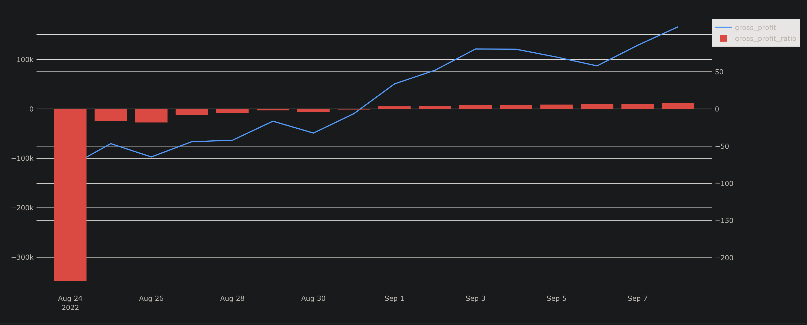
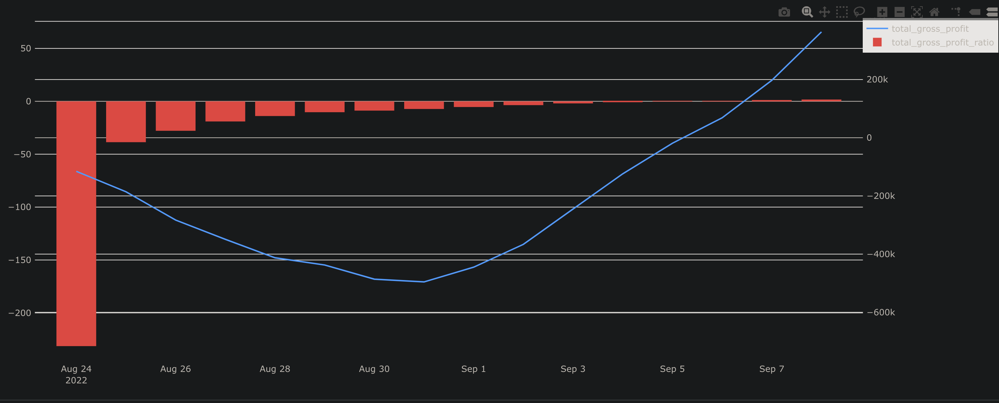

# Влияние оптимизации стоимости сборки заказа на валовую прибыль в сентябре

  
  

Оптимизация стоимости сборки заказа — снижение с **140 до 115** — напрямую способствовала росту валовой прибыли в сентябре.

> 💡 Все данные и визуализации доступны в интерактивном дашборде:  
> [**Gross Profit Dashboard**](https://redash.public.karpov.courses/dashboards/9038-gross-profit)

## Обоснование

### До сентября (август)
- Высокие переменные затраты (**140 за заказ**) в сочетании с относительно низким объёмом заказов приводили к убыткам, несмотря на рост выручки.
- Маржинальность оставалась близкой к **0%** (см. линию `gross_profit_ratio` на графике).

### С сентября
- Несмотря на увеличение **фиксированных затрат** с **120 000 до 150 000**, снижение стоимости сборки заказа на **25 единиц** дало значимый эффект:
  - **Экономия** ≈ **37 500** при объёме в **1 500 заказов** (`1 500 × 25`);
  - **Ускорение роста валовой прибыли**: синяя линия (`gross_profit`) после **1 сентября** демонстрирует более крутой восходящий тренд по сравнению с августом.
- Динамика подтверждает результат:
  - В конце августа валовая прибыль составляла ≈ **100 000**;
  - К **7 сентября** — уже превысила **150 000**,
  
  что было бы невозможно без снижения переменных затрат.

## Вывод
Оптимизация стоимости сборки заказа стала **ключевым фактором**, позволившим:
- компенсировать рост фиксированных затрат,
- усилить положительную динамику прибыли в сентябре,
- вывести бизнес на устойчивую рентабельность.
