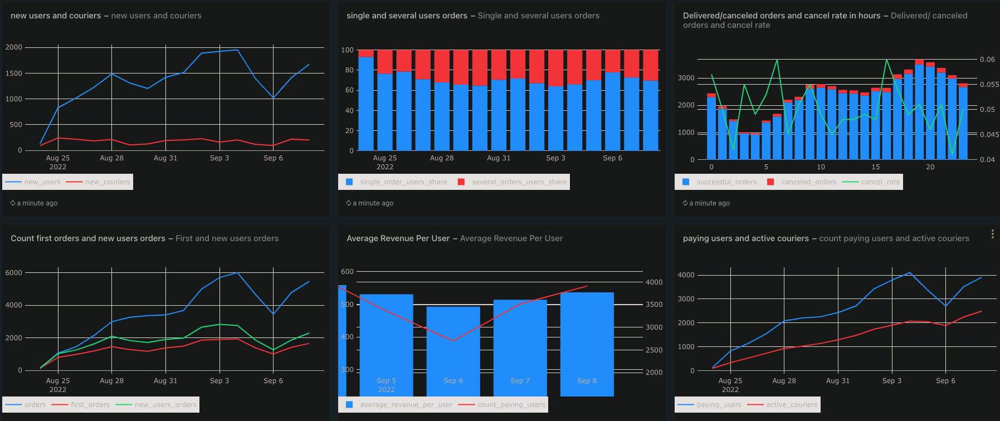

# Детальный анализ графиков и ключевые инсайты  
*(Период: 25 августа — 8 сентября 2022 года)*

---

## 📈 **1. Рост пользователей и курьеров**  
**График: `new users and couriers`**

- **Новые пользователи (синяя линия)** показывают устойчивый рост с ~200 до пика в ~2000 к 3 сентября, после чего происходит коррекция (~1000) и новый рост к 8 сентября.  
- **Новые курьеры (красная линия)** растут гораздо медленнее и стабильнее — от ~100 до ~200, с небольшими колебаниями.

✅ **Инсайт:**  
> Платформа активно привлекает пользователей, но рост курьеров отстает. Это может создать дисбаланс спроса и предложения — риск увеличения времени доставки или снижения качества сервиса, если темпы роста курьеров не выровняются.

---

## 🧩 **2. Структура заказов: один vs несколько пользователей**  
**График: `single and several users orders`**

- Доля пользователей, делающих **единичные заказы**, стабильно высокая — около 70–80%.  
- Доля пользователей, делающих **несколько заказов**, составляет 20–30%.

✅ **Инсайт:**  
> Большинство пользователей — новички или случайные клиенты. Низкая доля повторных заказов указывает на слабую вовлеченность или отсутствие мотивации к повторным покупкам. Есть потенциал для улучшения retention через программы лояльности, персонализированные предложения или push-уведомления.

---

## 🚫 **3. Успешные и отмененные заказы + отменный rate**  
**График: `Delivered/canceled orders and cancel rate in hours`**

- Общее количество **успешных заказов (синие столбцы)** растет со временем, достигая пика в районе 3500.  
- Количество **отмененных заказов (красные столбики)** также растет, но в меньшей степени.  
- **Отменный rate (зеленая линия)** колеблется в диапазоне 4–6%, с пиками до 6%.

✅ **Инсайт:**  
> Отменный rate остается в пределах нормы (обычно <7% считается хорошим), но есть пики до 6% — стоит проанализировать причины (например, задержки курьеров, проблемы с оплатой, недоступность товаров). Особенно тревожны пики в 5–6 часов и 15–16 часов — возможно, это связано с пиковыми нагрузками или сбоем в системе.

---

## 🎯 **4. Первые заказы vs общие заказы**  
**График: `Count first orders and new users orders`**

- **Общее количество заказов (синяя линия)** растет быстрее, чем **первые заказы (красная линия)**.  
- **Заказы новых пользователей (зеленая линия)** — между ними, но ближе к первым заказам.

✅ **Инсайт:**  
> Это подтверждает, что основной рост приходится на новых пользователей — старые пользователи не активно повторяют заказы. Стратегия должна быть направлена на **удержание новых пользователей** — например, через приветственные бонусы, рекомендации или email-рассылки.

---

## 💰 **5. Средний доход на пользователя и количество платящих**  
**График: `Average Revenue Per User`**

- **Средний доход на пользователя (синие столбцы)** колеблется от ~450 до ~550.  
- **Количество платящих пользователей (красная линия)** растет постепенно, особенно заметен рост с 6 по 8 сентября.

✅ **Инсайт:**  
> ARPU стабилен, что говорит о стабильности ценовой политики. Но рост числа платящих пользователей — хороший сигнал: платформа становится более монетизируемой. Можно рассмотреть возможность повышения ARPU через upsell (дополнительные услуги, премиум-подписки).

---

## 🚶‍♂️ **6. Активные курьеры и платящие пользователи**  
**График: `paying users and active couriers`**

- **Платящие пользователи (синяя линия)** растут быстрее, чем **активные курьеры (красная линия)**.  
- К 8 сентября платящих пользователей ~4000, а активных курьеров — ~2500.

✅ **Инсайт:**  
> Соотношение платящих пользователей к активным курьерам ~1.6:1. Это может быть критически низким, если каждый курьер обслуживает слишком много заказов — риск перегрузки, снижения качества сервиса и отказа курьеров. **Рекомендуется ускорить привлечение курьеров** или оптимизировать маршруты/логистику.

---

# 🧠 **Обобщенные выводы и рекомендации**

### 🔑 **Основные проблемы:**
1. **Дисбаланс между пользователями и курьерами** → риск снижения качества сервиса.  
2. **Низкая вовлеченность** → большинство пользователей делают только первый заказ.  
3. **Пики отменных заказов** → нужно исследовать причины (особенно в часы пик).

### 💡 **Рекомендации:**
- Запустить **программу лояльности** для новых пользователей (скидка на второй заказ, бонусы за отзывы).  
- Увеличить **привлечение курьеров** через партнерские программы, бонусы за активность.  
- Проанализировать **причины отмен** в пиковые часы — возможно, технические сбои или нехватка курьеров.  
- Ввести **премиум-услуги** для повышения ARPU (экспресс-доставка, выбор курьера, подписка).  
- Оптимизировать **логистику** — возможно, использовать алгоритмы распределения заказов для снижения нагрузки на курьеров.

---

### 📈 **Ключевые тренды:**

✅ Рост новых пользователей — +900% (от 200 до 2000).  
⚠️ Рост курьеров отстает — всего +100% (от 100 до 200).  
📉 Низкая повторная активность — 70–80% пользователей делают только 1 заказ.  
💰 ARPU стабилен (~500), но растет число платящих пользователей.  
🚫 Пик отменных заказов — до 6% в часы пик (5–6 и 15–16).
